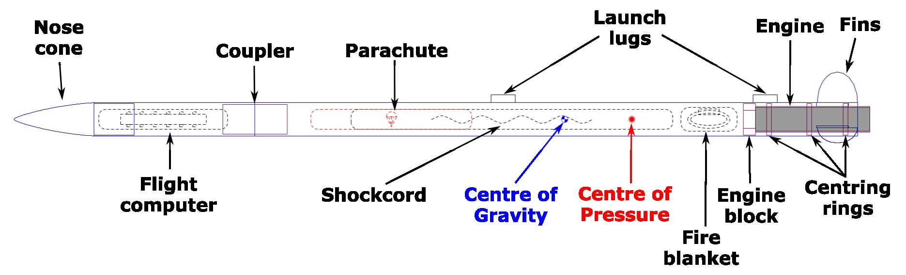
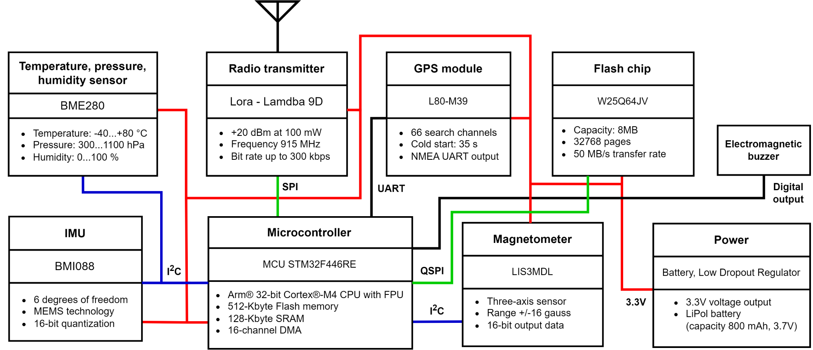
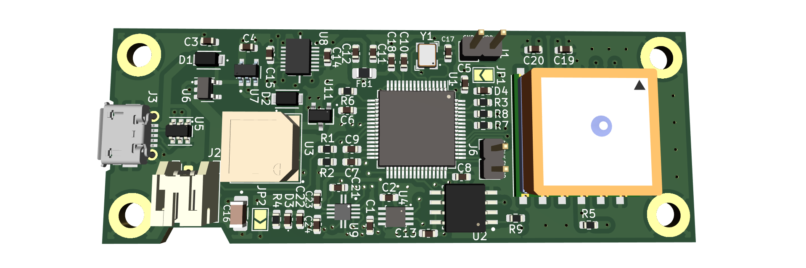
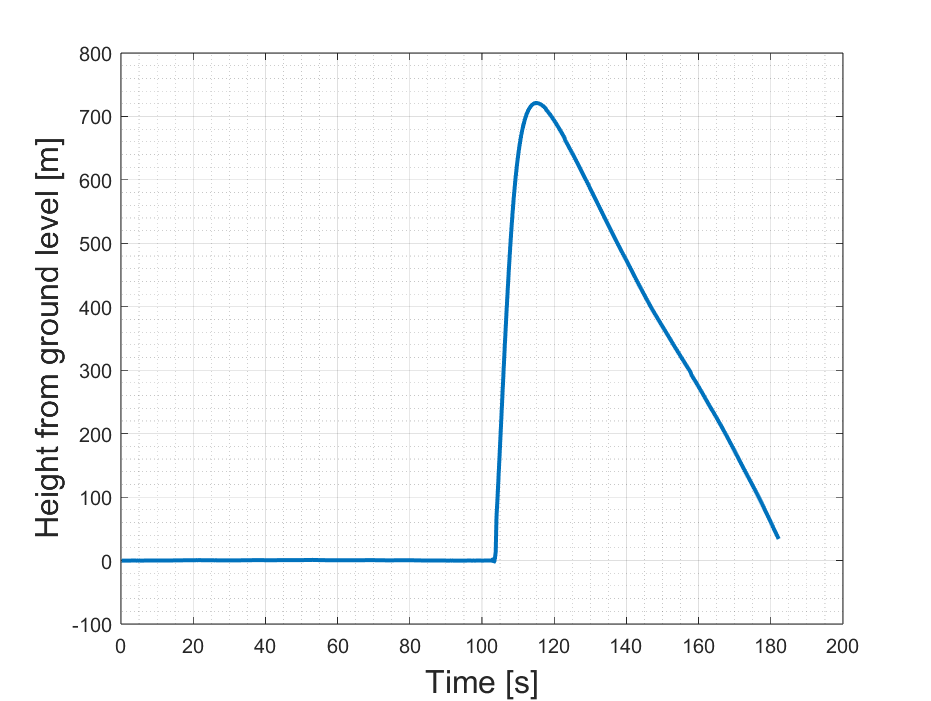

# Imperial College Space Society - High-power Rocketry

## Rocket

The rocket was initially designed in a program called OpenRocket and then the particular components were designed in Fusion 360 and manufactured using 3D printers or a laser cutter.

## Flight computer

The flight computer is based on STM32 platform and the main diagram with its components can be seen below.

The following picture shows the 3D render of the flight computer designed in KiCAD.

## Receiver

The table documents the connection of the radio module into STM32 F446RE Nucleo Board used as a receiver.

| **Lambda 9D pin** | **STM32 Nucleo F446RE pin** |
|-------------------|-----------------------------|
| nSel - 16         |             GND             |
| SDI - 15          |             PA7             |
| SDO - 14          |             PA6             |
| SCLK - 13         |             PA5             |
| RESET - 12        |             PB12            |
| GND - 2           |             GND             |
| Vcc - 3           |             3V3             |
| RX_SWITCH - 4     |             PC2             |
| TX_SWITCH - 5     |             PA4             |

## Launch

The rocket was successfully launched and recovered on 9th July 2023 in Twycross, Leicestershire. The rocket reached the altitude of 721 m after 11.4 s of flight.

## Future improvements

- UART connection for debugging
- Button/jumper pin header for resetting STM32
- Code for IMU, magnetometer and flashchip
- FreeRTOS for the flight computer
- Modify serial logging script such that the incoming data is being processed and then saved as csv

## Repository content

- `Assets` - This folder contains images and plots for the `README.md` file.
- `Hardware/circuit board design v1.0` - First version of the hardware files of the flight computer.
- `Hardware/circuit board design v2.1` - Second version of the hardware files of the flight computer.
- `Hardware/Documentation` - Documentation files with spreadsheets containing components selection and power consumption.
- `Rocket` - This folder contains files simulation and design files for the rocket.
- `References` - This folder contains datasheets and manuals relevant to the components used for the flight computer.
- `Software/Dev board code` - This folder contains projects used to develop and test libraries for each of the components of the computer.
- `Software/revision_1` - First version of the flight computer software.
- `Software/revision_1_rx` - First version of the receiver software.
- `Software/serial_logging` - Code for the serial logging of the received data.

## Team (Academic year 2022/2023)

- Awais Khawaja (Rocket team lead)
- Rohan Kukreti, Stephen Liu (Nose cone)
- Heather Boatin (Recovery system)
- Denzel Goh, Dongxiao Jiang (Fins)
- Jack Crane (Engine mount)
- Timothy Newman, Lou Alsteens, and Jakub Jędrzejewski (PCB)
- Václav Pavlíček, Richard Hu, Benny Liu (Software)

## Acknowledgements

We would like to thank Victor Boddy from the Electrical Engineering Undergraduate lab and the Advanced Hackspace staff for their help and support.